**110行動裝置遊戲設計實務 - 期末專案**     
  
  [Chess AR.apk (94MB)](https://drive.google.com/file/d/13LeX6eS1dzOnNXEKHqeKtOgoarpVy0Ic/view?usp=sharing)
  
 一、專題名稱：Chess AR   
    
  二、專題功能簡述：讓使用者透過AR App方便且快速、隨時隨地的遊玩西洋棋，同時亦可享有沉浸式的體驗。使用者僅需在空曠場合或任一平面上使用手機上的APP即可投影出立體西洋棋進行對戰。   
    
    
  三、開發環境需求

<table class="c17">

<tbody>

<tr class="c11">

<td class="c12" colspan="1" rowspan="1">環境版本</td>

<td class="c19" colspan="1" rowspan="1">Unity 2020.3.25f1 (LTS)</td>

</tr>

<tr class="c11">

<td class="c12" colspan="1" rowspan="1">插件版本</td>

<td class="c19" colspan="1" rowspan="1">ARCore SDK v1.25.0, Photon Unity Networking v2.40</td>

</tr>

</tbody>

</table>

四、西洋棋設計理念：配合遊玩AR上的使用，且考慮到使用者周遭之情境，設計上將以簡約爲主，並以突出特點及容易辨識的朝向前進。   
    
  五、設計圖 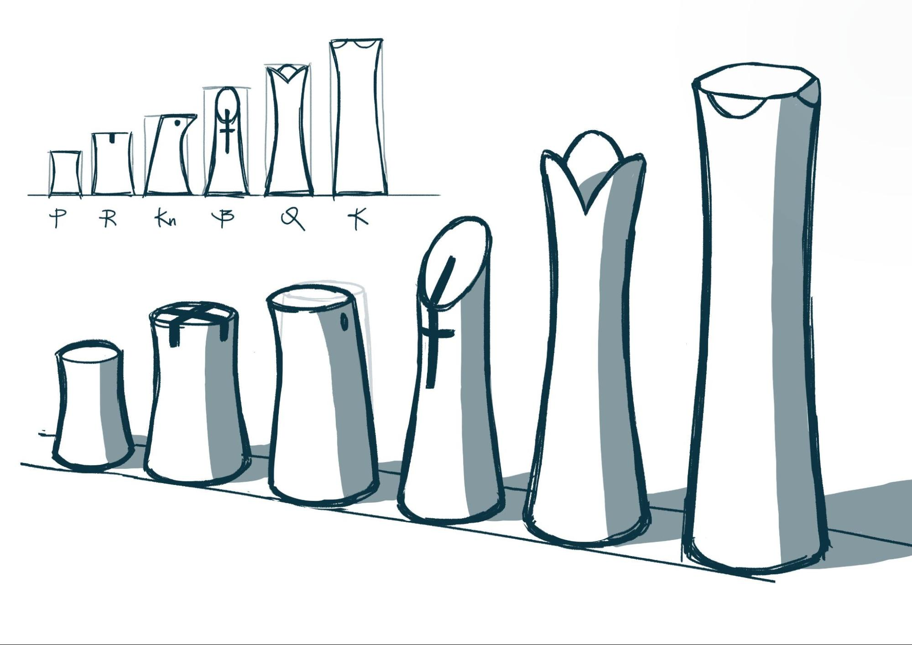 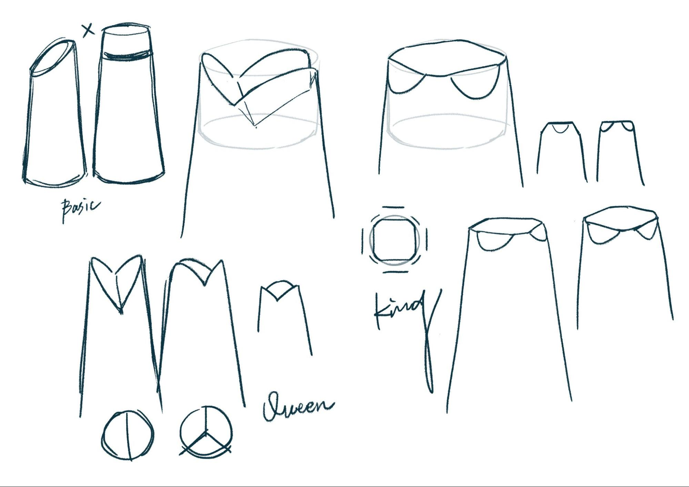 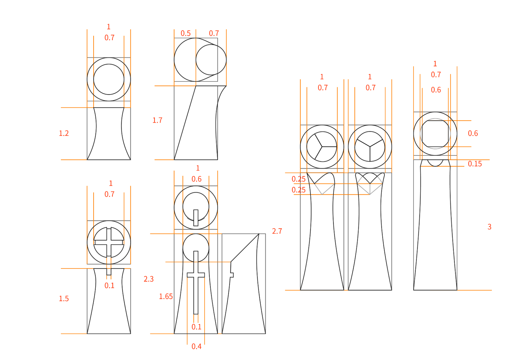   
    
  六、3D製作 使用軟體：Blender, 3ds Max  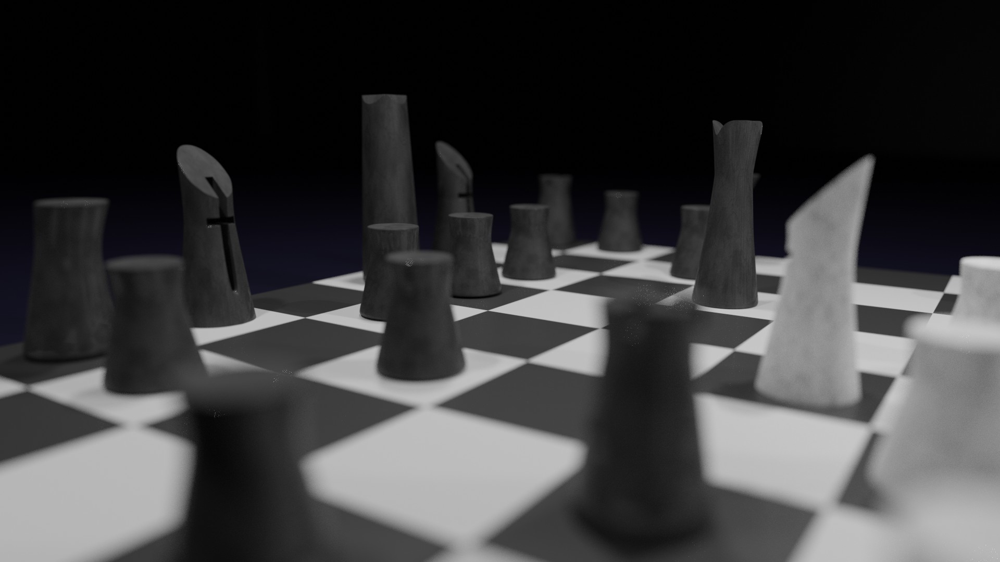   
    
  七、UI設計 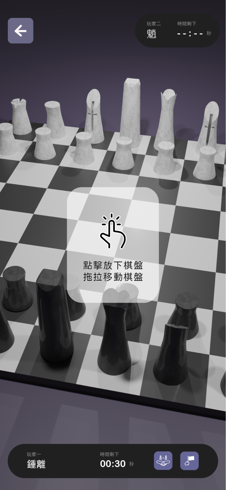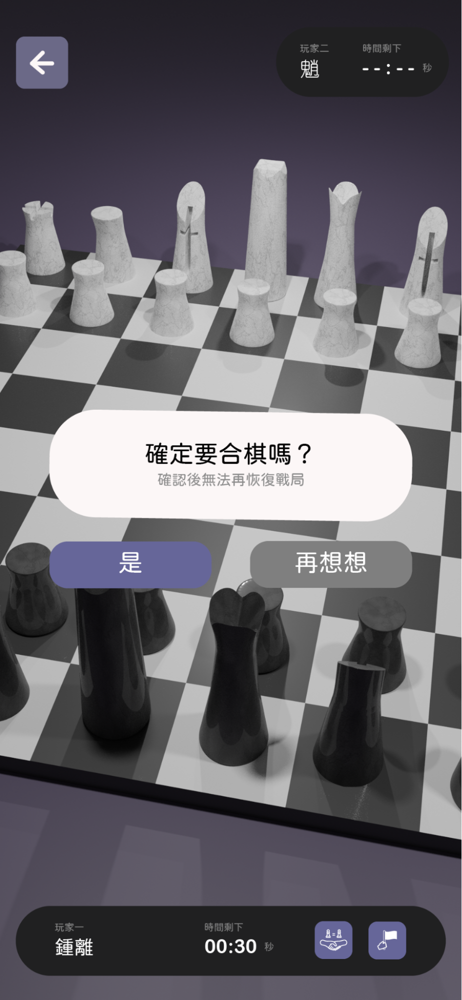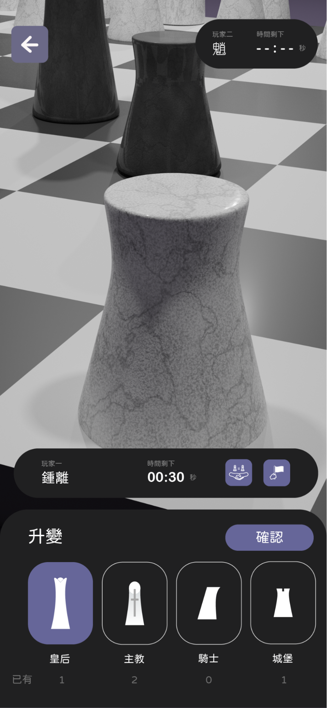   
    
  八、組員分工

<table class="c17">

<tbody>

<tr class="c11">

<td class="c18" colspan="1" rowspan="1">學號</td>

<td class="c20" colspan="1" rowspan="1">姓名</td>

<td class="c13" colspan="1" rowspan="1">負責工作</td>

</tr>

<tr class="c11">

<td class="c18" colspan="1" rowspan="1">108AC1006</td>

<td class="c20" colspan="1" rowspan="1">鄭高峰</td>

<td class="c13" colspan="1" rowspan="1">程式撰寫</td>

</tr>

<tr class="c11">

<td class="c18" colspan="1" rowspan="1">108AC1009</td>

<td class="c20" colspan="1" rowspan="1">陳語哲</td>

<td class="c13" colspan="1" rowspan="1">程式編輯</td>

</tr>

<tr class="c11">

<td class="c18" colspan="1" rowspan="1">108840009</td>

<td class="c20" colspan="1" rowspan="1">劉潔昕</td>

<td class="c13" colspan="1" rowspan="1">平面設計</td>

</tr>

<tr class="c11">

<td class="c18" colspan="1" rowspan="1">108AC1037</td>

<td class="c20" colspan="1" rowspan="1">黃靖娉</td>

<td class="c13" colspan="1" rowspan="1">3D製作 & UI 界面</td>

</tr>

</tbody>

</table>

  
  九、操作說明   
  請注意: 在體驗正式開始之前，請確保您的裝置支援且已安裝最新版本的[ARCore](https://www.google.com/url?q=https://developers.google.com/ar/devices&sa=D&source=editors&ust=1642973287632753&usg=AOvVaw0u64jFhVVPeUoLfDuk3g0L)，否則體驗過程中將會發生可預期之錯誤並造成遊戲自動關閉。   
    
  在進入初始畫面後，點擊螢幕的任意位置後遊戲便會嘗試將您連上伺服器(連線速度與穩定性因裝置、電信商與地區而異)，而後將進入大廳介面。請根據需求進行以下操作↓   
  創建者：建立一個新的遊戲房間，於上方欄位中輸入想要的房號後點擊Create   
  加入者：加入一既有的遊戲房間，於下方欄位中輸入該房的房號後點擊Join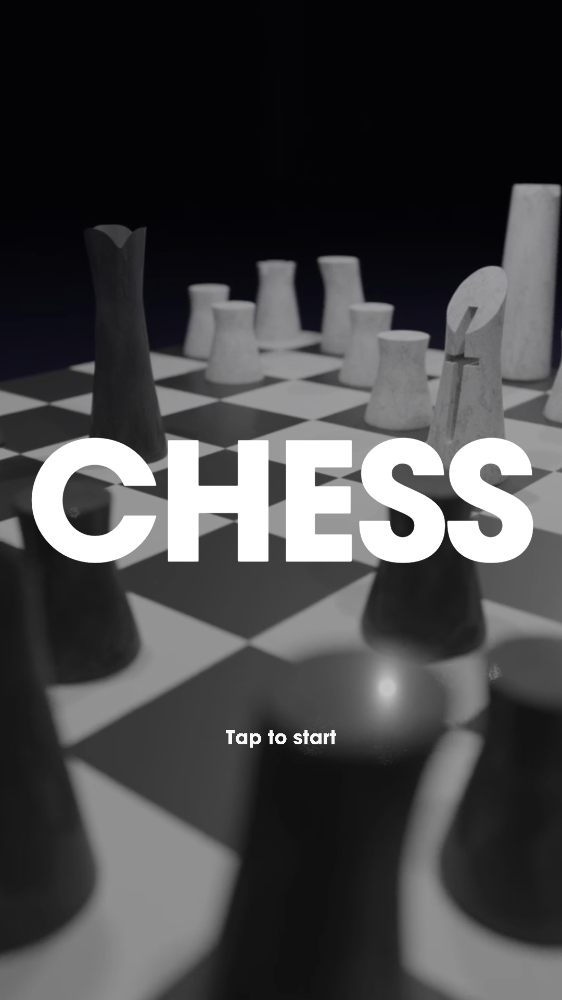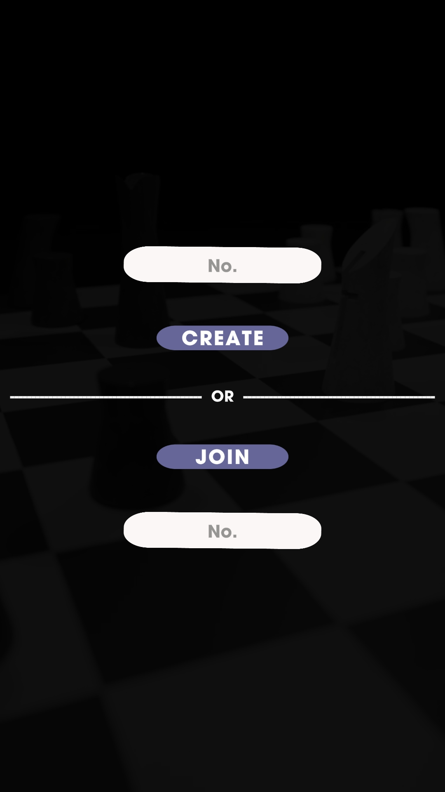   
    
  初次執行時請同意使用相機的權限，將裝置至於環境明亮處移動尋找水平面。若出現網格狀面則偵測成功，點擊以放置棋盤。點擊棋盤上的棋子將會出現其於當前回合中可移動的範圍。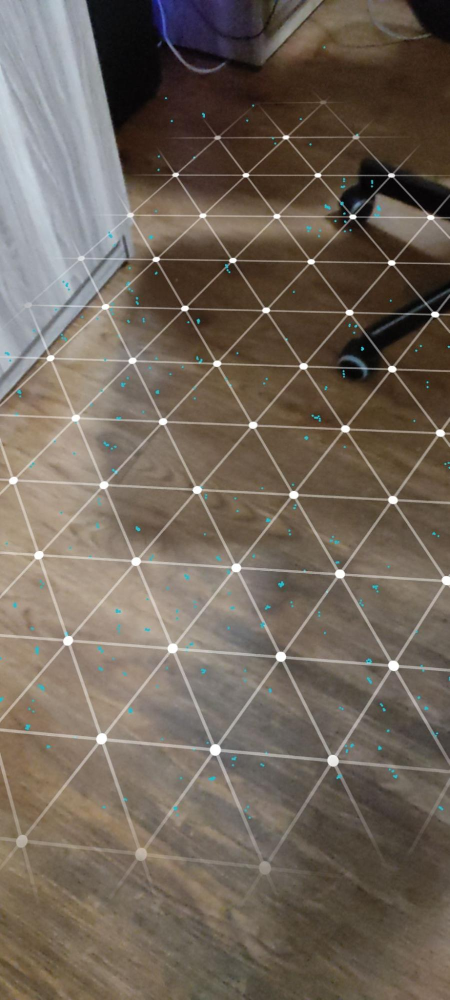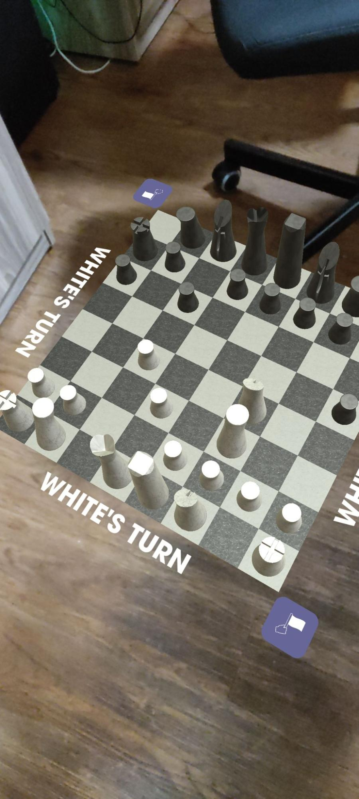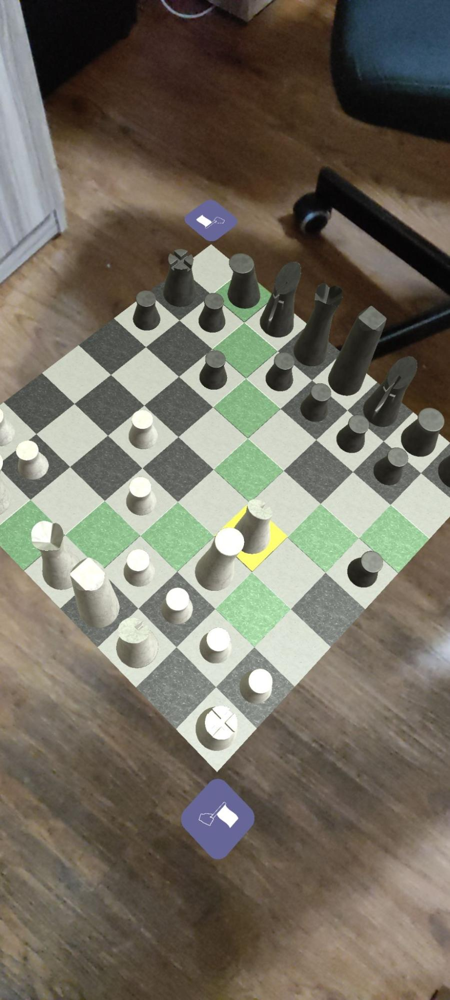   
    
  在一方移動過棋子後，便會輪到對方回合，場景中的文字同時也會提醒雙方當前為哪方的回合。誰先誰後由系統預設為↓   
  創建者：白方(先手)   
  加入者：黑方(後手)   
  在只有一部裝置連入的情況下(單人、本地雙人)亦可正常遊玩。 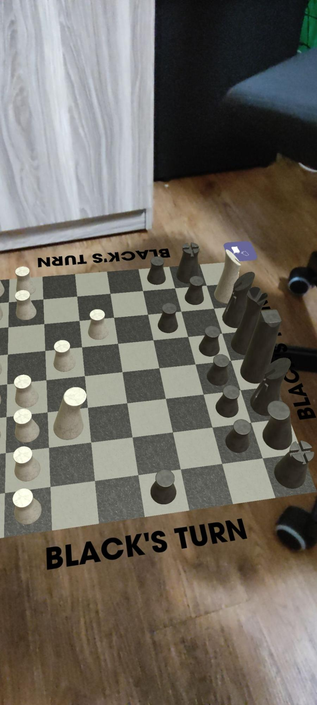   
    
  按下返回鍵可回到大廳，仍有人在房間中時棋局將被保留。最終勝利條件有二↓   
  1\. 將死對手的國王   
  2\. 對手按下投降鍵   
  勝利後將跳轉至結算畫面，畫面則會因勝方而有所不同。 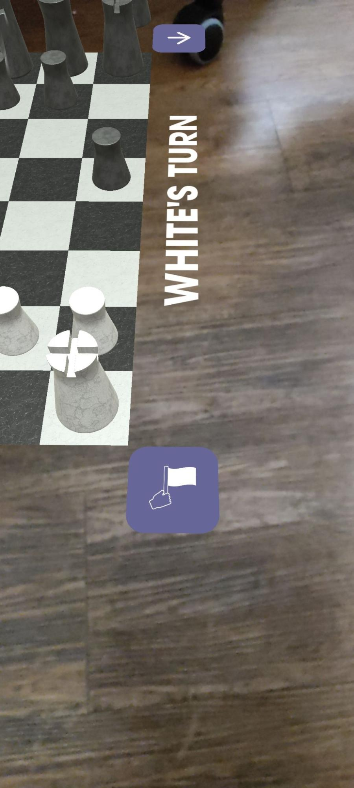
